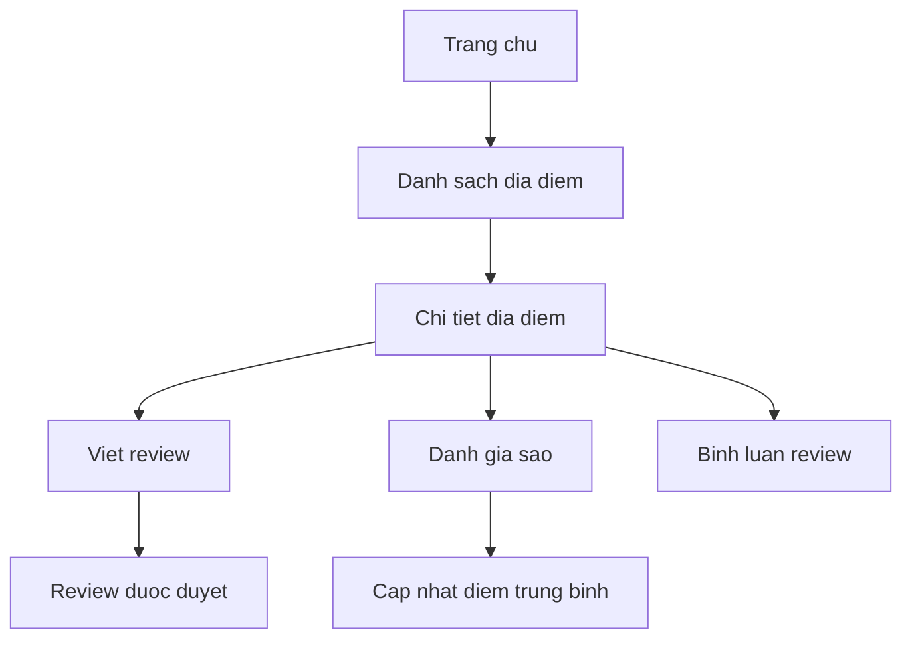

# Bao cao du an Travel Review

## Chuong 1. Gioi thieu de tai
### Muc tieu he thong
- Xay dung ung dung web Travel Review bang Laravel, giup nguoi dung tim kiem va danh gia dia diem du lich.
- Cung cap giao dien de su dung, truc quan tren ca desktop va mobile.
- Ho tro quan tri noi dung va thong ke tong quan cho admin.

### Doi tuong su dung
- Nguoi dung thong thuong: xem dia diem, viet review, danh gia sao, binh luan, quan ly yeu thich.
- Quan tri vien: quan ly dia diem, review, comment, user; theo doi thong ke hoat dong.

### Y nghia thuc tien
- Tao nen nen tang thong tin du lich tap trung, giup nguoi dung ra quyet dinh nhanh hon.
- Khuyen khich chia se trai nghiem va phan hoi cho cong dong.
- Nâng cao chat luong du lieu qua quy trinh kiem duyet va phan quyen.

## Chuong 2. Phan tich he thong
### Use case
**Nguoi dung:**
- Dang nhap/Dang ky.
- Xem danh sach dia diem.
- Tim kiem dia diem.
- Xem chi tiet dia diem.
- Viet review cho dia diem.
- Danh gia sao (rating) cho dia diem.
- Binh luan tren review.
- Quan ly danh sach yeu thich.

**Quan tri vien:**
- Dang nhap admin.
- Xem dashboard thong ke.
- Quan ly dia diem (CRUD).
- Quan ly review (duyet/tu choi/xoa).
- Quan ly comment (duyet/tu choi/xoa).
- Quan ly user (khoa/mo khoa/xoa).

### Chuc nang he thong
- Locations: danh sach, tim kiem, chi tiet.
- Reviews: tao review, hien thi theo dia diem, trang thai duyet.
- Ratings: danh gia sao, cap nhat diem trung binh.
- Comments: binh luan theo review, trang thai duyet.
- Favorites: luu dia diem yeu thich.
- Admin: dashboard thong ke, CRUD dia diem, quan ly user/review/comment.

### Thiet ke CSDL
**Bang users**
- id, name, email, password, role, is_active, timestamps.

**Bang locations**
- id, name, slug, description, address, region, category, image, avg_rating, user_id, timestamps.

**Bang reviews**
- id, title, content, image (co the bo su dung), status, user_id, location_id, timestamps.

**Bang ratings**
- id, score, comment, user_id, location_id, timestamps.

**Bang comments**
- id, content, status, user_id, review_id, timestamps.

**Bang favorites**
- id, user_id, location_id, timestamps.

**Quan he chinh:**
- users 1-n reviews, comments, ratings, favorites.
- locations 1-n reviews, ratings, favorites.
- reviews 1-n comments.

### So do luong xu ly
**Luong user:**
- Trang chu -> danh sach dia diem -> chi tiet dia diem -> review/rating/comment -> cap nhat diem trung binh.

**Luong admin:**
- Admin dashboard -> danh sach quan ly -> thao tac CRUD/duyet -> cap nhat thong ke.

## Chuong 3. Thiet ke va xay dung
### Kien truc Laravel MVC
- **Model**: users, locations, reviews, ratings, comments, favorites.
- **View**: Blade template cho user va admin.
- **Controller**: xu ly nghiep vu, dieu phoi du lieu vao view.
- **Route**: tach ro giua user va admin, co middleware auth/admin.

### Cac module chuc nang
- Locations: hien thi danh sach, tim kiem theo tu khoa, xem chi tiet.
- Reviews: tao review, hien thi review, trang thai duyet.
- Ratings: danh gia sao va cap nhat avg_rating.
- Comments: binh luan theo review.
- Favorites: luu dia diem yeu thich.
- Admin: dashboard thong ke, CRUD locations, quan ly review/comment/user.

### Giao dien he thong
**Auth (dang nhap, dang ky)**
- Them nen va can giua card.
- Nut hien/an mat khau (icon mat).
- Thuong hieu "Travel Review" mau xanh, font Pacifico, co chu lon.
- Bo quen mat khau, them nut register o trang login, bo register o trang chu.

**Trang user**
- Header: tang padding, gian cach nut menu, canh khoang cach voi brand.
- Search: can cung hang voi o text.
- Card dia diem: theo mau, co anh lon, icon dia diem, sao vang, bo gia, link view details mau den.
- Hover card: nang len, bong do, zoom anh nhe.

**Admin**
- Doi header ngang thanh sidebar ben trai, responsive tren mobile.
- Nut action dep va gon, canh phai, giam do dai.
- Them border cho nut va link admin.

**Dashboard**
- Bieu do reviews theo thang luon hien thi 6 thang gan nhat ke ca khi khong co du lieu.

## Chuong 4. Ket qua thuc hien
### Hinh anh giao dien
- Hinh auth: card can giua, nen anh, thuong hieu ro rang.
- Hinh danh sach dia diem: card theo mau, icon va sao vang.
- Hinh admin: sidebar ben trai, cac nut action dong bo.

### Chuc nang da hoan thanh
- Dang nhap/dang ky, chuyen huong ve danh sach dia diem.
- Danh sach dia diem, tim kiem, xem chi tiet.
- Review/rating/comment, cap nhat diem trung binh.
- Favorites (yeu thich).
- Admin CRUD dia diem, quan ly review/comment/user, dashboard thong ke.

### Huong phat trien
- Bo sung seeder dia diem Viet Nam va comment tieng Viet.
- Them bo loc nang cao (region/category).
- Toi uu hieu nang va giao dien mobile.
- Bo sung thong ke chi tiet va xuat bao cao.
